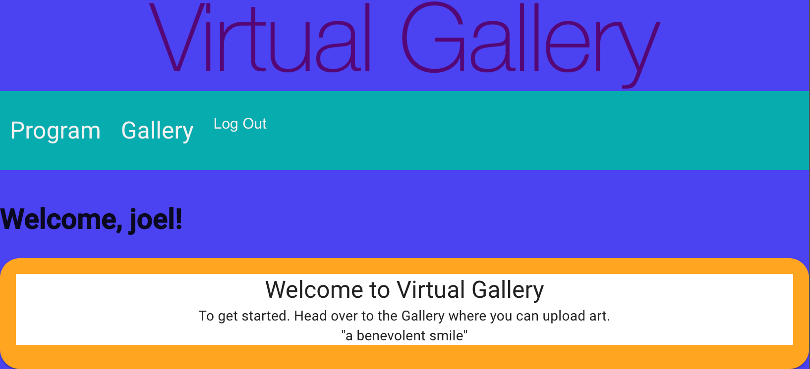
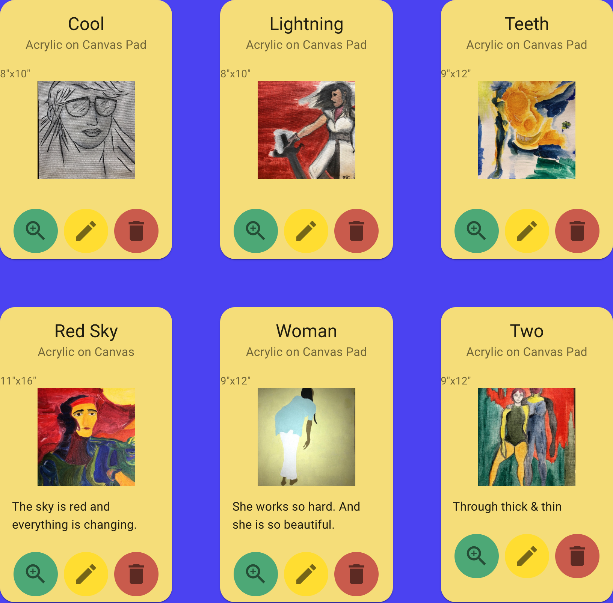

# Virtual Gallery

## Welcome to Your Virtual Gallery

_Duration: 200hrs_

Succeeding as an artist in incumbent on showing your work. The further you go as an artist. The more daunting this circumstance becomes. More artwork means more vigilance. Idealy all your artwork would be accessible in one place. Virtual Gallery is a Web Application that solves the problem of keeping track of your work. 

Save any, and all of your artwork to virtual gallery. As the name implies. Each artwork you create is saved to the database and is viewable in your personal gallery.

At your volition, attach pertinent information to an artwork, which can be updated at any time. Or an artwork can be removed from the gallery, and deleted from the database altogether.






### Prerequisites

- [Material-UI] ()
- [Node.js](https://nodejs.org/en/)
- [React.js](https://reactjs.org/)
- [React-Redux] (https://react-redux.js.org/)
- [Redux-Saga] (https://redux-saga.js.org/)
- [PostgreSQL] (https://www.postgresql.org/)

### SETUP

Create your database and tables using the provided `data.sql` file. Start the server.

```
npm install
npm run server
```

Now that the server is running, open a new terminal tab with `cmd + t` and start the react client app.

```
npm run client
```

## Curate Your Gallery

1. After reading your greeting on the 'Program' page, click 'Gallery' on the navbar to enter the Gallery. You will be countenanced an Add-Art Form which you will use to upload an image of your Art and attach pertinent information. Click 'SUBMIT' to save your artwork to the Gallery. 
2. Your created artwork is represented by an art card which displays a miniturized image of your art. Click the green button on the card to view your artwork. Click 'Gallery' on the navbar to return to the Gallery
3. Click the edit button on the art card to open edit mode. Make updates to your selected artwork using the edit form at the bottom of the page.
4. To delete an artwork, Click the delete button on the art code in question.

## Acknowledgement
Thanks to [Prime Digital Academy](www.primeacademy.io) who equipped and helped me to make this application a reality. Thank you https://github.com/freder48 for inspiring me with your styling and teaching me Material-UI.
## Support
If you have suggestions or issues, please email me at [jkado@my.hpu.edu](www.google.com)
