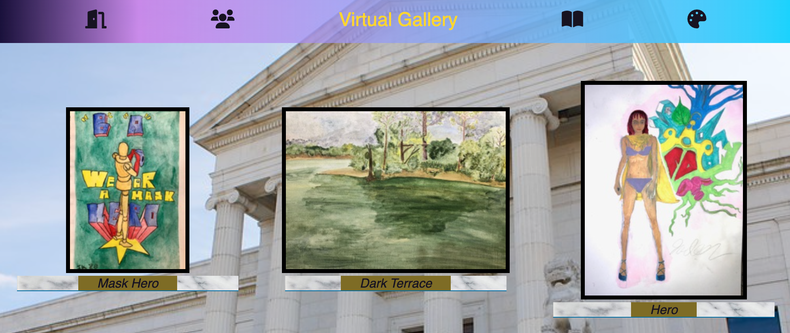

# Virtual Gallery

## Welcome to Your Virtual Gallery

_Duration: Ongoing Commitment_

Artists, 
showing your work publicly is a big job. Virtual Gallery is an opportunity to immediately start sharing your art with the world. -Curate a gallery of your own work: build frames for your artwork in the Studio -share your art with friends
--learn your strengths and weaknesses as an artist: other artists will like some of your paintings more than others. Through implementation of Joeleen's Like Filtration System, Your most popular paintings will be brought to the front of your Gallery.


<!--  -->


### Prerequisites

- [Material-UI](https://material-ui.com/)
- [Node.js](https://nodejs.org/en/)
- [React.js](https://reactjs.org/)
- [React-Redux](https://react-redux.js.org/)
- [Redux-Saga](https://redux-saga.js.org/)
- [PostgreSQL](https://www.postgresql.org/)

### SETUP

Create your database and tables using the provided `data.sql` file. Start the server.

```
npm install
npm run server
```

Now that the server is running, open a new terminal tab with `cmd + t` and start the react client app.

```
npm run client
```

## Curate Your Gallery

1. Head to the Studio to publish artwork to your gallery. 
2. View your Artwork in your gallery. 

## Share 
 Head over to the Forum to View the galleries of other Artists. 'Like artworks as you please'.

## Grow
Your gallery pushes your most liked work to the front of your Gallery, enabling you to see which aspects of your craft
need work.

## Acknowledgement
Thanks to My family and friends for maintaining hope in me.

## Support
If you have comments or issues, please email me at [joeleen.kado@gmail.com](www.google.com)
